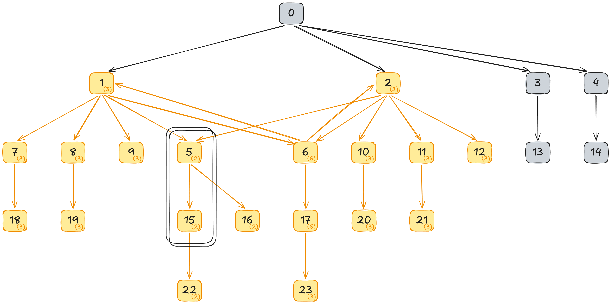
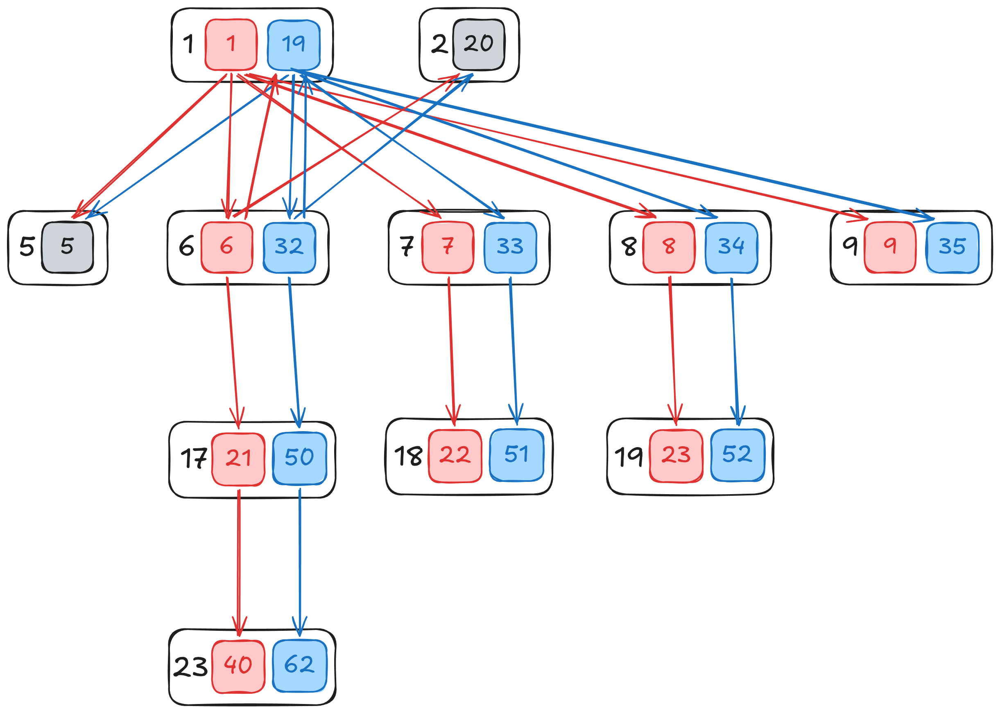

# The APLR(1) Algorithm for Generating Compact LR(1) Parsers is Simpler and More Capable than IELR(1)

[This is an evergreen version of an originally web-published technical report. [^evans2026]]

The [Hocc](https://github.com/BranchTaken/Hemlock/blob/main/doc/tools/hocc.md) parser generator,
which is part of the [Hemlock](https://github.com/BranchTaken/Hemlock) programming language project,
implements a novel LR(1)-family parser generation algorithm called Adequacy Preservation LR(1).
APLR(1) generates compact parsers that are devoid of LR(1)-relative inadequacies, even for
nondeterministic/ambiguous grammars. Thus APLR(1) parser automata are suitable for use with
[Generalized LR (GLR)](https://en.wikipedia.org/wiki/GLR_parser) parsing techniques, but the
practical implication for deterministic parsing is that mysterious conflicts never arise during
grammar development. Furthermore APLR(1) is useful in combination with any LR(1)-family parser
generation algorithm that may introduce unnecessary state splits. As a case in point, Hocc's
IELR⁺(1) algorithm is a generalized extension of the original
[Bison](https://en.wikipedia.org/wiki/GNU_Bison) IELR(1) algorithm that also supports
nondeterministic/ambiguous grammars, but this algorithm sometimes induces precautionary state splits
that are ultimately unnecessary, and APLR(1) augments IELR⁺(1) such that APLR(1) and IELR⁺(1) may be
used interchangeably.

## Introduction

Knuth discovered the LR(k) algorithm [^knuth1965] for parsing [deterministic context-free
grammars](https://en.wikipedia.org/wiki/Deterministic_context-free_grammar) over six decades ago and
showed that LR(1) is a reasonable restriction, but at the time even LR(1) was too computationally
intensive to be usable. The LALR(1) algorithm [^deremer1969] is not as capable as canonical LR(1),
but despite superior alternatives since discovered, LALR(1) remains the *de facto* LR(1)-family
algorithm of choice. The relative obscurity of PGM LR(1) [^pager1977] appears to be due to a
combination of confusion surrounding related lane tracing research
[^pager1973][^spector1981][^spector1988], along with having been overshadowed by the rapid
dissemination of the LALR(1) algorithm via the [Yacc](https://en.wikipedia.org/wiki/Yacc) parser
generator. The limited adoption of IELR(1) is due at least in part to its conceptual complexity,
incidentally also a lane tracing approach. In contrast, APLR(1) is a straightforward application of
subgraph isomorphism search, and understanding requires only basic graph theory and a limited
knowledge of LR(1) automaton structure.

What constitutes a practical LR(1)-family parser? Algorithmic complexity has execution and data
components; in order for a parser to be practical it must be both sufficiently fast and sufficiently
small. Furthermore, parser *generation* is distinct from parsing, and excessive generation-time
overhead can make an algorithm impractical even if parse-time performance is amazing.

At the time of LR(1) discovery, both parser generation and parsing were impractical, most critically
because canonical LR(1) automata can be extremely large even for modest grammars. All deterministic
LR(1)-family parsers use the same [pushdown automaton
(PDA)](https://en.wikipedia.org/wiki/Pushdown_automaton) algorithm, so research on efficient PDAs
generally applies; the parser generation algorithms distinguish themselves by generating smaller
automata, in some cases restricting what grammars can be expressed. Following is a modern
perspective on the tradeoffs inherent to the algorithms discussed in this report.

| Algorithm | Year | LR(1)-relative power | Automaton size | Generation overhead |
|:----------|------|----------------------|----------------|---------------------|
| LR(1)     | 1965 | =                    | Maximal        | Moderate            |
| LALR(1)   | 1969 | ⊂                    | Inadequate     | Low                 |
| PGM LR(1) | 1977 | =¹                   | Compact²       | Low                 |
| IELR(1)   | 2010 | =                    | Compact        | Low-moderate        |
| IELR⁺(1)  | 2024 | ⊃³                   | Compact        | Moderate-high       |
| APLR(1)   | 2026 | ⊃³                   | Compact        | Moderate-high       |

1 &mdash; Precedence/associativity not supported.
2 &mdash; Assuming weak compatibility test; strong compatibility guarantees minimality.
3 &mdash; Nondeterminism/ambiguity supported, technically also true of LR(1) automata.

Canonical LR(1) automata are maximal in that any further splitting of states would result in
reduntant identical states; LALR(1) automata are inadequate in that all possible state merging is
blindly performed; the compact automata are commonly minimal, but greedy algorithms make no
guarantee regarding minimality. Maximal automata remain unwieldy on modern computers due to
generated code size and low execution locality, though not intractably so. Inadequate automata are
to be avoided. The compact automata make no parse-time compromises, and generation-time compromises
are modest, quickly trending toward negligible as hardware continues to improve.

The LALR(1) algorithm [^deremer1969] is so prevalent that many practitioners unquestioningly accept
its shortcomings. Although LALR(1) utilizes symbol lookahead during parsing, an LALR(1) automaton is
generated by merging states with equal LR(0) item sets, i.e. by disregarding lookahead. Three types
of mysterious conflicts can result. The well-known **_mysterious new conflicts_** caused by LALR(1)
state merging are always **_reduce-reduce conflicts_**, but it is also possible for state merging to
create **_mysterious invasive conflicts_** that are caused by merging **_shift-reduce conflicts_**
into states which would otherwise have performed a reduce action. Furthermore, it is possible to
create **_mysterious mutated conflicts_** by merging multiple reduce-reduce conflicts that have
distinct resolutions. Such **LR(1)-relative inadequacy** often causes an LALR(1) parser to recognize
a different language than does the corresponding LR(1) parser, and reasoning about these differences
is fraught with peril.

**Precedence** and **associativity** in grammar specifications are so ubiquitous that it is easy to
forget that these are actually mechanisms for disambiguating non-LR(1) grammars. The LR grammar
family is fundamentally deterministic, and multiple parsing actions for a given configuration
indicate grammar ambiguities. Precedence specifications rank actions such that ambiguities can be
resolved so long as one action has higher precedence than all other alternatives. Associativity
provides a secondary mechanism for preferring left associativity (reduce rather than shift), right
associativity (shift rather than reduce), etc. These mechanisms are of great practical value, but
they are optional; grammars can always be reformulated, at some inconvenience and negative impact
on the implied parse tree, to remove precedence/associativity without affecting the language
recognized by the parser.

The PGM LR(1) algorithm [^pager1977][^pottier] incrementally merges states during automaton
generation so long as it can assure that no subsequent mysterious conflicts will arise. However, the
algorithm only works reliably for LR(1) grammars; although no mysterious new conflicts arise from
precedence/associativity disambiguation, mysterious invasive/mutated conflicts may arise.

The IELR(1) algorithm [^denny2010a] analyzes an unresolved LALR(1) automaton (all possible conflicts
present) and traces lanes backward from conflicts far enough to determine which states may need to
be split in order to avoid mysterious conflicts. It then generates an IELR(1) automaton that has all
LR(1)-relative inadequacies eliminated. The lane tracing is quite fast because the algorithm assumes
that there are no ambiguities in the corresponding LR(1) automaton, meaning that at most one action
can be contributed via each lane in the LR(1) automaton.

Generalized LR (GLR) [^tomita1986] supports nondeterminism. Whereas non-LR(1) grammars contain
"ambiguous" non-singleton action sets, GLR treats ambiguity as nondeterminism and applies
non-singleton action sets in parallel and accepts an input if any parallel automaton execution
reaches an accept state. Although GLR provides (too much?) additional freedom during grammar
development, care is still required when pairing GLR with an automaton. For example, it is unsafe to
use an LALR(1) automaton with conflict resolution enabled because mysterious conflicts may be
resolved such that GLR never considers actions critical to full grammar recognition. Unfortunately,
this mode of operation confounds analysis of incidental versus fundamental grammar nondeterminism.
IELR(1) is similarly unsafe in combination with GLR because it applies conflict resolution to
mysterious conflicts that arise due to its inability to handle incompletely resolved non-LR(1)
grammars.

The IELR⁺(1) algorithm [^evans2024] differs from IELR(1) in that no assumptions are made regarding
ambiguities in the corresponding LR(1) automaton. Multiple (conflicting) actions may flow through
each lane in the LR(1) automaton. Lane tracing is more complicated because closure (global fixpoint)
must be reached rather than terminating tracing anywhere contributed action sets are empty or
singletons. Furthermore, cyclical dependencies induced by closure sometimes necessitate
precautionary state splits during IELR⁺(1) automaton generation that ultimately end up having been
unnecessary, but these split states can be remerged using the same algorithm as for APLR(1). As an
example of the difference between IELR(1) and IELR⁺(1), consider the
[Gawk](https://www.gnu.org/software/gawk/) 3.10 grammar that was an IELR(1) case study
[^denny2010a].

| Algorithm | Resolve | States | S/R conflicts | R/R conflicts |
|:----------|---------|-------:|--------------:|--------------:|
| LALR(1)   |     yes |    320 |            65 |             0 |
| IELR(1)   |         |    329 |            65 |             0 |
| IELR⁺(1)  |         |    367 |            66 |             0 |
|           |         |        |               |               |
| LALR(1)   |      no |    320 |           410 |             0 |
| IELR(1)   |         |    320 |           410 |             0 |
| IELR⁺(1)  |         |    367 |           410 |             0 |

IELR(1) generates the same states as LALR(1) in the presence of conflicts that are unresolved in the
corresponding LR(1) automaton, whereas IELR⁺(1) splits additional states to eliminate (incompletely
disambiguated) LR(1)-relative inadequacy. The additional shift/reduce conflict (66 versus 65)
suggests that IELR⁺(1) avoids a mysterious conflict that IELR(1) inadvertently resolves. This
algorithmic distinction is worth calling attention to because IELR⁺(1) and APLR(1) are duals of each
other, making them both more capable than IELR(1).

The APLR(1) algorithm analyzes an LR(1) automaton, exhaustively searches for split state subgraphs
which can be remerged without changing the recognized language, then performs all remerges. APLR(1)
applies the remerging algorithm to a canonical LR(1) automaton, but Hocc also uses the remerging
algorithm by default for automata generated by IELR⁺(1) and PGM LR(1). Earlier versions of Hocc
implemented a simpler iterative state pair remerging algorithm [^evans2024], discovered
independently by Lenka and Kumar [^lenka2006]. The iterative algorithm has the disadvantage of being
incapable of remerging non-singleton cyclic subgraphs.

There is one subtle consequence of state merging that affects all of the above algorithms, namely
that it is possible for a sequence of reduce actions to lead to a state that contains no action for
the lookahead symbol, i.e. a syntax error. This can confound error reporting because the parsing
configuration of interest was that which existed prior to the first such reduce action. Fortunately
there is a straightforward solution, commonly referred to as lookahead correction (LAC)
[^denny2010b]. This mitigation captures the parser state prior to reducing and restores the state if
an error is encountered. Hocc supports only pure semantic actions (i.e. no side effects are
allowed), so LAC is simple, inexpensive, and universal.

The remainder of this report describes the LR(1) and APLR(1) algorithms as implemented by Hocc in
sufficient detail to enable independent reimplementation, followed by experimental comparison of
parser generation algorithms.

## Canonical LR(1)

### Terminology

The following common example "arithmetic" grammar in Hocc format suffices for defining various
relevant terms as they are used in the Hocc source code.

```hocc
hocc
    left mul
    left add < mul
    token STAR "*" prec mul
    token SLASH "/" prec mul
    token PLUS "+" prec add
    token MINUS "-" prec add
    token INT
    token EOI
    nonterm MulOp ::=
      | "*"
      | "/"
    nonterm AddOp ::=
      | "+"
      | "-"
    nonterm Expr ::=
      | Expr MulOp Expr prec mul
      | Expr AddOp Expr prec add
      | INT
    start Answer ::= Expr EOI
```

A grammar comprises production rules, abbreviated as **_prod(s)_**. `Answer ::= Expr EOI` and `Expr
::= INT` are examples of prods. A prod has a left-hand side (LHS), which is always a non-terminal
symbol, abbreviated as **_nonterm_**. `Answer` and `Expr` are examples of nonterms. A prod also has
a right-hand side (RHS), which is a sequence of nonterms and **_tokens_**. `STAR`, its alias `"*"`,
and `EOI` are examples of tokens. Each token and nonterm has an associated **_first set_** of tokens
which may come first and a **_follow set_** of tokens which may come immediately after. Each token's
first set trivially contains the token itself, and the token first sets serve as the initial state
for computing first/follow set closure of all symbols. See the Hocc source code or a compilers
textbook [^aho2007][^cooper2023] for detailed first/follow set closure algorithms.

An **_LR(0) item_** is a prod with associated position, where the current parsing position is
indicated by a dot. For example, `Answer ::= · Expr EOI`, `Answer ::= Expr · EOI`, and `Answer ::=
Expr EOI ·` are distinct LR(0) items based on the same prod.

An **_LR(1) item_** is an LR(0) item with an associated **_follow set_**, i.e. a set of tokens which
may immediately follow the prod. For example, `MulOp ::= · "*", {INT}` indicates that a
multiplication operator may be followed only by an integer. For a less obvious example, `Expr ::= ·
INT, {"*", "/", "+", "-", EOI}` indicates that an integer may be followed by a math operator or
end-of-input (`EOI`). Note that the dot position is irrelevant to the follow set; the same symbols
may follow the prod regardless of current dot position. In contrast, the dot position *is* relevant
to the **_first set_**, i.e. the set of tokens which may immediately follow the dot.

An **_LR(0) item set_**, also known as a **_core_**, is simply a set of LR(0) items. Two cores are
**_isocores_** if they are isomorphic, i.e. they comprise identical LR(0) item sets.

An **_LR(1) item set_**, also known as a **_kernel_**, is simply a set of LR(1) items, also known as
**_kernel items_**. Two kernels are **_isokernels_** if they are isomorphic, i.e. they comprise
identical LR(1) item sets. A kernel can be mapped to a core by extracting the LR(0) items from all
all LR(1) items. LR(1)-family parser generation algorithms differ only in how aggressively they
split/merge sets of states with isocores but distinct kernels; canonical LR(1) and LALR(1) are at
the extremes of this continuum.

An **_LR(1) item set closure_** comprises a kernel and an **_added set_** of LR(1) items, which
corresponds to the set of productions reachable from the kernel without advancing the input. A
**_state_** comprises an LR(1) item set closure, an action set for each expected token, and a goto
for each distinct LHS nonterm in the added set. A **_goto_** set can be computed for each symbol to
the right of a dot. These goto sets define kernels of successor states.

For implementation reasons having primarily to do with IELR⁺(1), Hocc uses an additional layer of
data structures:

- state ⊃ **_state nub_** ⊃ LR(1) item set closure
- goto ⊃ **_goto nub_** ⊃ LR(1) item set

However, this layering also enables optimizations to the data structures which track isocore sets.

Parser generators have long supported grammar disambiguation via precedence and associativity. For
example `mul` has higher precedence than `add`, both of which are left-associative. Hocc differs
from most parser generators in that precedences comprise an explicit optionally-disjoint directed
acyclic graph, rather than a mostly implicit single linear precedence order.

### Work queue processing

Hocc uses an iterative work queue process to incrementally close on the set of state nubs
corresponding to states in the automaton. Work queue ordering is not fundamental to automaton
generation, but it does impact state nub creation order, and therefore state indexing. No effort is
made to puzzle together isocores via optimal merging order, but care is taken to insert at the front
versus back of the work queue in such a way as to process states in an approximately breadth-first
order rather than depth-first. Consistent queue ordering logic for all automaton generation
algorithms assures that isocore set indexes (i.e. LALR(1) state indexes) are universal, and
APLR(1)/IELR⁺(1) automata are typically identical.

Once the work queue is seeded with start state nubs, state nubs are consumed from the head of the
work queue and processed until none remain, i.e. a fixpoint has been reached. The work queue
contains each _distinct_ state nub exactly once, over the entire duration of work queue processing.
The end goal is to traverse the entirety of the resulting automaton once. What makes a state nub
distinct is critical to understanding the work queue behavior. If a kernel compatibility test
determines that two non-isokernels are compatible, the merged result is distinct from at least one
of the input isokernels, even though the state nub index stays the same. A state nub index may
ephemerally correspond to a series of distinct state nubs, and although some of those ephemeral
state nubs may never reach the front of the work queue, the last one certainly will. Given this
understanding, the work queue insertion regimen is straightforward:

- A state nub that is not the result of a merge is pushed onto the back of the work queue unless
  already present in the work queue.
- A state nub that is the result of merging two non-isokernels is pushed onto the front of the work
  queue unless already present in the work queue.

### State nub generation/merging

State nub generation begins with the grammar's start symbol(s). A pseudo-start symbol and kernel
item is wrapped around each start symbol, always with a kernel of the form `Start' ::= · Start "⊥",
{"ε"}`, e.g. `Answer' ::= · Answer "⊥", {"ε"}` in the example grammar. Multiple computations lead to
a fully defined state nub, namely closing on the added set and then computing the goto set for each
symbol to the right of a dot. These goto sets are in some cases merged into existing compatible
states, and in other cases define distinct state nubs not yet encountered during automaton
construction.

For the example grammar, the pseudo-start symbol results in the following state; the corresponding
state nub is inserted into both the work queue and the state nub set:

```
State 0
    Kernel
        [Answer' ::= · Answer "⊥", {"ε"}]
    Added
        [Expr ::= · Expr MulOp Expr, {"*", "/", "+", "-", EOI}] prec mul
        [Expr ::= · Expr AddOp Expr, {"*", "/", "+", "-", EOI}] prec add
        [Expr ::= · INT, {"*", "/", "+", "-", EOI}]
        [Answer ::= · Expr EOI, {"⊥"}]
    Actions
        INT : ShiftPrefix 1
    Gotos
        Expr : 2
        Answer : 3
```

Note that every symbol immediately to the right of a dot is represented in the **_actions_** or
**_gotos_**, for tokens and nonterms respectively. Consider `Expr`, which is to the right of
multiple dots. Each item in the goto set for `Expr` is created by advancing the dot past `Expr`
anywhere it appears before a dot in this state. The following kernel results:

```
[Expr ::= Expr · MulOp Expr, {"*", "/", "+", "-", EOI}] prec mul
[Expr ::= Expr · AddOp Expr, {"*", "/", "+", "-", EOI}] prec add
[Answer ::= Expr · EOI, {"⊥"}]
```

A work queue state nub is processed by 1) popping it from the front of the work queue, and 2)
computing goto sets, such that work queue and state nub set insertion may result.

Canonical LR(1) isocore merge compatibility is maximally strict, in that kernels must be isokernels
in order to be merged. Merging two isokernels results in an isokernel; thus merging is a no-op. Such
strict compatibility commonly results in nearly identical states which could be merged without
changing the grammar recognized by the automaton. APLR(1) removes (nearly) all such redundancy.

### State generation

Each state is created by augmenting the corresponding state nub with an **_actions_** map from
tokens to action sets (shift to successor state and/or one or more reductions) and a **_gotos_** map
from nonterms to successor states.

- Each LR(1) item with a token immediately following the dot generates a shift action.
- Each LR(1) item with the dot past all RHS symbols generates a reduce action for each token in the
  follow set.
- Each LR(1) item with a nonterm immediately following the dot generates a goto map entry.

## APLR(1)

The APLR(1) algorithm is fundamentally about remerging states while preserving parser behavior.
Whereas IELR(1) starts with an LALR(1) automaton and eliminates inadequacies via state splitting,
APLR(1) starts with an optionally resolved canonical LR(1) automaton and preserves LR(1)-relative
adequacy during state remerging. Remerging is implemented in two phases:

1. Exhaustively consider all isocoric state pairs in the LR(1) automaton and search for remergeable
   subgraphs, i.e. maximal non-overlapping isomorphic subgraphs.
2. Remerge and reindex all discovered compatible state sets to generate a derivative APLR(1)
   automaton.

In order for two subgraphs to be remergeable, every state pair's pairwise out-transitions must meet
at least one of the following criteria:

- Shifts:
  + The successor state indexes are equal.
  + The successor states are transitively remergeable.
- Reductions:
  + The states perform identical reductions.
  + State `X₀` takes no action for a symbol `s`, and state `X₁` performs only reduction(s) for
    symbol `s`. Furthermore, for more than two states to be remergeable, all additional states must
    contain either no actions on symbol `s`, or actions identical to those of state `X₁`.
- Gotos:
  + The successor state indexes are equal.
  + The successor states are transitively remergeable.
  + State `X₀` contains no goto for a symbol `s`, and state `X₁` does contain a goto for symbol `s`.
    Furthermore, for more than two states to be remergeable, all additional states must contain
    either no goto for symbol `s`, or a goto successor that is remergeable with that of state `X₁`.

In the worst case all isocoric state pairs must be considered for remergeability — n choose 2
combinations for each n-element isocoric state set, i.e. O(n²). However, observed algorithmic
complexity is closer to linear than quadratic, for two reasons.

1. Transitive remergeability testing results compose and typically have substantial overlap. If a
   state pair is noted as **_mergeable_**, any subsequent subgraph remergeability test which reaches
   the mergeable pair need not repeat the work that was done to discover that the pair is mergeable.
   Similarly if a state pair is noted as **_distinct_**, any subsequent subgraph remergeability test
   which reaches the distinct pair fails. Furthermore, every state pair from the starting point of
   the search along the **_spine_** to the distinct pair can be transitively noted as distinct.
2. State pairs that are determined to be remergeable can be immediately clustered for purposes of
   subsequent pairwise testing, which Hocc trivially implements by removing one of the remergeable
   states from the set being tested. Each time two states are clustered, complexity reduces from n
   choose 2 to n-1 choose 2. In the extreme (yet common) case that all states in an isocoric state
   set are remergeable, the incremental complexity reductions converge on Ω(n).

The remergeability testing algorithm is greedy; the order in which isocoric state pairs are tested
can impact later tests, and a slightly different automaton can result. Thus APLR(1) greedily
generates compact automata rather than generating globally minimal automata, the latter of which is
NP-hard [^yang2021].

The Hocc implementation performs pairwise remergeability tests as described, but an alternate
implementation could perform an n-way test and iteratively refine partitions of the subgraph sets
upon discovering distinctions [^valmari2012]. However, this approach would require more
sophisticated bookkeeping, without offering any algorithmic complexity advantage, and it would still
be necessary to make arbitrary partitioning choices for non-hierarchical subgraph mergeability
relations among the n subgraphs.

Reindexing is only strictly necessary if the parser implementation requires contiguous indexes.
However, Hocc reindexes both states and isocore set indexes primarily because it simplifies manual
automaton introspection, especially comparisons between automata generated using differing
algorithms. Hocc preserves the lowest state index for each set of remergeable states when remerging,
and during reindexing it maintains relative state order while renumbering from 0 upward.

As mentioned, APLR(1) and IELR⁺(1) are duals of each other, and with minor changes an APLR⁻(1)
implementation could exist as a dual of IELR(1). The only necessary change relative to APLR(1) would
be to treat all ambiguous actions present in the LR(1) automaton as remergeable. However, while
there are some compelling tradeoffs for IELR(1) over IELR⁺(1) (faster parser generation, no need to
remerge unnecessary precautionary splits), APLR⁻(1) has nothing to recommend it over APLR(1).

### Example

Consider this transcription of Pager's G2 grammar [^pager1977]:

```hocc
hocc
    token At
    token Bt
    token Ct
    token Dt
    token Et
    token Tt
    token Ut
    token EOI

    start Sn ::= Xn EOI

    nonterm Xn ::=
      | At Yn Dt
      | At Zn Ct
      | At Tn
      | Bt Yn Et
      | Bt Zn Dt
      | Bt Tn

    nonterm Yn ::=
      | Tt Wn
      | Ut Xn

    nonterm Zn ::= Tt Ut

    nonterm Tn ::= Ut Xn At

    nonterm Wn ::= Ut Vn

    nonterm Vn ::= epsilon
```

As indicated by the following state counts, 38/40 state splits are remergeable.

| Algorithm | States                 |
|-----------|-----------------------:|
| LALR(1)   | [24](PagerG2_lalr.txt) |
| APLR(1)   | [26](PagerG2_aplr.txt) |
| LR(1)     | [64](PagerG2_lr.txt)   |

Following is a graphical depiction of the G2 automaton with isocoric state sets collapsed and set
sizes in parentheses. APLR(1) remerges all isocoric state sets aside from 5 and 15.



The full LR(1) automaton comprises 64 states, most of which are omitted in the following graphical
depiction. However the red and blue subgraphs represent the full extents of two remergeable
subgraphs. Note that both extend to states 2 and 5 (successor states are equal), and as long as
every state pair is otherwise remergeable, the subgraphs are transitively remergeable.



Following are representative state pairs extracted from the [LR(1) automaton report](PagerG2_lr.txt)
that illustrate why subgraphs are (non-)remergeable. Whereas the automaton report refers to e.g.
states 1 and 19 which are elements 0 and 1 of isocore set 1 (`1 [1.0]`, `19 [1.1]`), the following
exposition uses a more succinct nomenclature, 1{1, 19}, that closely corresponds to the above
graphical depiction.

#### Transitively remergeable

```
State 1 [1.0]                      | State 19 [1.1]
    Kernel                         |     Kernel
        [Xn ::= At · Yn Dt, {EOI}] |         [Xn ::= At · Yn Dt, {At, Dt}]
        [Xn ::= At · Zn Ct, {EOI}] |         [Xn ::= At · Zn Ct, {At, Dt}]
        [Xn ::= At · Tn, {EOI}]    |         [Xn ::= At · Tn, {At, Dt}]
    Added                          |     Added
        [Yn ::= · Tt Wn, {Dt}]     |         [Yn ::= · Tt Wn, {Dt}]
        [Yn ::= · Ut Xn, {Dt}]     |         [Yn ::= · Ut Xn, {Dt}]
        [Zn ::= · Tt Ut, {Ct}]     |         [Zn ::= · Tt Ut, {Ct}]
        [Tn ::= · Ut Xn At, {EOI}] |         [Tn ::= · Ut Xn At, {At, Dt}]
    Actions                        |     Actions
        Tt : ShiftPrefix 5         |         Tt : ShiftPrefix 5
        Ut : ShiftPrefix 6         |         Ut : ShiftPrefix 32
    Gotos                          |     Gotos
        Yn : 7                     |         Yn : 33
        Zn : 8                     |         Zn : 34
        Tn : 9                     |         Tn : 35
```

The differences between isocoric state set 1 members 1 and 19 correspond to those shown in the
graph, namely differing successor states in isocoric state sets 6, 7, 8, and 9. States 1 and 19
(1{1, 19}) are remergeable if these differing successor states (6{6, 32}, 7{7, 33}, 8{8, 34}, 9{9,
35}) are transitively remergeable.

```
State 21 [17.0]                    | State 50 [17.2]
    Kernel                         |     Kernel
        [Yn ::= Ut Xn ·, {Dt}]     |         [Yn ::= Ut Xn ·, {Dt}]
        [Tn ::= Ut Xn · At, {EOI}] |         [Tn ::= Ut Xn · At, {At, Dt}]
    Actions                        |     Actions
        At : ShiftPrefix 40        |         At : ShiftPrefix 62
        Dt : Reduce Yn ::= Ut Xn   |         Dt : Reduce Yn ::= Ut Xn
```

Isocoric state set 17 members 21 and 50 transition to differing successor states in isocoric state
set 23 on `At`, and perform the same reduction on `Dt`. States 21 and 50 are remergeable if the
differing successor states (23{40, 62}) are transitively remergeable.

```
State 40 [23.0]                      | State 62 [23.1]
    Kernel                           |     Kernel
        [Tn ::= Ut Xn At ·, {EOI}]   |         [Tn ::= Ut Xn At ·, {At, Dt}]
    Actions                          |     Actions
        EOI : Reduce Tn ::= Ut Xn At |         At : Reduce Tn ::= Ut Xn At
                                     |         Dt : Reduce Tn ::= Ut Xn At
```

Isocoric state set 23 members 40 and 62 contain only disjoint actions, which makes them remergeable
(23{40, 62}).

#### Transitively non-remergeable

```
State 5 [5.0]                  | State 10 [5.1]
    Kernel                     |     Kernel
        [Yn ::= Tt · Wn, {Dt}] |         [Yn ::= Tt · Wn, {Et}]
        [Zn ::= Tt · Ut, {Ct}] |         [Zn ::= Tt · Ut, {Dt}]
    Added                      |     Added
        [Wn ::= · Ut Vn, {Dt}] |         [Wn ::= · Ut Vn, {Et}]
    Actions                    |     Actions
        Ut : ShiftPrefix 17    |         Ut : ShiftPrefix 24
    Gotos                      |     Gotos
        Wn : 18                |         Wn : 25
```

Isocoric state set 5 members 5 and 10 transition to differing successor states in isocoric state set
15 on `Ut`, and to differing successor states in isocoric state set 16 on `Wn`. States 5 and 10 are
remergeable if the differing successor states (15{17, 24}, 16{18, 25}) are transitively remergeable.

```
State 17 [15.0]                    | State 24 [15.1]
    Kernel                         |     Kernel
        [Zn ::= Tt Ut ·, {Ct}]     |         [Zn ::= Tt Ut ·, {Dt}]
        [Wn ::= Ut · Vn, {Dt}]     |         [Wn ::= Ut · Vn, {Et}]
    Added                          |     Added
        [Vn ::= ·, {Dt}]           |         [Vn ::= ·, {Et}]
    Actions                        |     Actions
        Ct : Reduce Zn ::= Tt Ut   |
        Dt : Reduce Vn ::= epsilon |         Dt : Reduce Zn ::= Tt Ut
                                   |         Et : Reduce Vn ::= epsilon
    Gotos                          |     Gotos
        Vn : 31                    |         Vn : 41
```

Isocoric state set 15 members 17 and 24 contain remergeable disjoint actions on `Ct` and `Et`, but
they contain conflicting actions on `Dt`. Therefore 15{17, 24} are non-remergeable, and 5{5, 10} are
transitively non-remergeable.

## Experiments

The following experiments use Hocc-compatible transcriptions of four grammars:

- Gawk: [GNU Awk](https://www.gnu.org/software/gawk/) 3.1.0, analyzed in the IELR(1) paper
  [^denny2010a]
- Gpic: [GNU groff](https://www.gnu.org/software/groff/) 1.18.1 gpic, analyzed in the IELR(1) paper
  [^denny2010a] and in the IELR(1) report [^evans2024]
- Lyken: An abandoned research language, developed using an [implementation of the PGM
  LR(1)](https://github.com/MagicStack/parsing) algorithm
- OCaml: [OCaml](https://ocaml.org/) 4.14

All experiments run Hocc main-0-g56e332cc8bda211a3e7aa1c65aefd67b7aead44a. Time and memory usage
statistics are collected with garbage collection (GC) disabled, e.g.

```sh
time -v hocc -gc no -resolve yes -src Gawk -algorithm lalr
```

GC overhead would dominate run time and memory usage for the smallest and largest automata, but it
also makes the state counts easier to interpret, so the state counts are generated with precise
post-remerging GC enabled, e.g.

```sh
hocc -gc post -resolve yes -src Gawk -algorithm lalr -verbose
```

The reported time/memory statistics are the best of three runs on an Apple MacBook M5 Pro, running
[Ubuntu](https://en.wikipedia.org/wiki/Ubuntu) Linux 24.04.03 as a virtual machine hosted by
[Parallels](https://en.wikipedia.org/wiki/Parallels_Desktop_for_Mac).

| Grammar / Resolve | Algorithm | Time (h:m:s) | Max RSS (kB) | States |
|------------------:|:----------|-------------:|-------------:|-------:|
| Gawk    /     yes | LALR(1)   |         0.07 |        36736 |    320 |
|                   | PGM LR(1) |         0.07 |        36736 |    320 |
|                   | IELR⁺(1)  |         2.39 |       255104 |    367 |
|                   | APLR(1)   |         0.29 |        60800 |    367 |
|                   | LR(1)     |         0.24 |        52352 |   2359 |
|                   |           |              |              |        |
|         /      no | LALR(1)   |         0.07 |        36864 |    320 |
|                   | PGM LR(1) |         0.07 |        36736 |    320 |
|                   | IELR⁺(1)  |         5.31 |       641280 |    367 |
|                   | APLR(1)   |         0.28 |        61056 |    367 |
|                   | LR(1)     |         0.22 |        52096 |   2467 |
|                   |           |              |              |        |
| Gpic    /     yes | LALR(1)   |         0.29 |        45056 |    423 |
|                   | PGM LR(1) |         0.32 |        46464 |    423 |
|                   | IELR⁺(1)  |         1.88 |       113024 |    428 |
|                   | APLR(1)   |         1.38 |       129280 |    428 |
|                   | LR(1)     |         1.09 |        98432 |   4834 |
|                   |           |              |              |        |
|         /      no | LALR(1)   |         0.29 |        45184 |    426 |
|                   | PGM LR(1) |         0.32 |        46464 |    426 |
|                   | IELR⁺(1)  |         2.61 |       136704 |    448 |
|                   | APLR(1)   |         1.35 |       129024 |    448 |
|                   | LR(1)     |         1.08 |        97792 |   4871 |
|                   |           |              |              |        |
| Lyken   /     yes | LALR(1)   |         0.85 |        90112 |   1340 |
|                   | PGM LR(1) |         1.84 |        96384 |   1340 |
|                   | IELR⁺(1)  |      5:56.67 |      6228736 |   1352 |
|                   | APLR(1)   |        11.43 |       853888 |   1352 |
|                   | LR(1)     |        10.48 |       776064 |  18755 |
|                   |           |              |              |        |
|         /      no | LALR(1)   |         0.82 |        88960 |   1375 |
|                   | PGM LR(1) |         1.82 |        97024 |   1375 |
|                   | IELR⁺(1)  |     12:42.89 |     30487808 |   1857 |
|                   | APLR(1)   |        11.59 |       861696 |   1760 |
|                   | LR(1)     |        10.47 |       766592 |  19590 |
|                   |           |              |              |        |
| OCaml   /     yes | LALR(1)   |         2.93 |        81920 |   1878 |
|                   | PGM LR(1) |         3.49 |        82432 |   1878 |
|                   | IELR⁺(1)  |        35.30 |      1158144 |   1878 |
|                   | APLR(1)   |      2:06.47 |      3479680 |   1878 |
|                   | LR(1)     |      1:44.94 |      2338560 | 106607 |
|                   |           |              |              |        |
|         /      no | LALR(1)   |         2.93 |        82176 |   1878 |
|                   | PGM LR(1) |         3.50 |        82176 |   1878 |
|                   | IELR⁺(1)  |      2:38.74 |      5465472 |   4585 |
|                   | APLR(1)   |     25:09.36 |      4744192 |   4586 |
|                   | LR(1)     |      1:45.35 |      2321280 | 106607 |

The performance numbers are best interpreted relative to each other, rather than in absolute terms.
Hocc is written in OCaml, using purely functional code and data structures. So far, so good, but
Hocc uses the Basis runtime library that is intended to correspond closely to the standard library
designed for the [Hemlock](https://github.com/BranchTaken/Hemlock) programming language. OCaml
provides 63-bit integers as its default high-performance integer type, but Hemlock's design calls
for 64-bit integers. As a consequence, the Basis library ubiquitously uses OCaml's boxed 64-bit
integers, which puts an epic load on OCaml's automatic memory management subsystem, not to mention
more than doubling memory usage for each integer and imposing pointer indirections. Hocc is likely
some multiple factor slower than optimal, but it is a mature parser generator implementation.
IELR⁺(1) and LR(1) are more than twice as fast as when reported in 2024 [^evans2024]; all the
automaton algorithms have been extensively worked and reworked.

What conclusions can be drawn from the experiments? First and foremost, APLR(1) is a viable option
for all the grammars, so long as conflict resolution is enabled. There is no practical reason to
disable conflict resolution for APLR(1) nor IELR⁺(1); these benchmarks are included only to provide
additional insight into how the algorithms operate and what their weaknesses are. First and
foremost, APLR(1) performance is limited by the number of states in the corresponding LR(1)
automaton, because the LR(1) automaton must be generated as the input to APLR(1). APLR(1)
performance is also negatively impacted by highly interconnected non-remergeable subgraphs; the more
branching in a non-remergeable subgraph, the more repeated graph exploration must occur. Similarly
for IELR⁺(1), the more interconnected a conflict contribution graph is, the more graph traversal
must occur to reach contribution closure. The main qualitative difference is that APLR(1) is
impervious to conflicts that are resolved in the corresponding LR(1) automaton, whereas IELR⁺(1)
must trace all reduce-dominant conflicts, regardless of whether those conflicts are resolved in the
corresponding LR(1) automaton.

The OCaml grammar transcription started as an educational tool to understand why the nascent Hemlock
grammar was causing generation performance problems for IELR⁺(1), and perhaps to learn how my
particular grammar development style might be modified. Interestingly, there is a stark difference
in grammar development styles, but whereas my style is adversarial for IELR⁺(1), the OCaml grammar
style is adversarial for APLR(1), due to >50X more LR(1) states than LALR(1) states!

APLR(1) and IELR⁺(1) generate different automata for Lyken and OCaml with conflict resolution
disabled. This is due to greedy remerging and merging, respectively, i.e. these are similar compact
automata rather than identical globally minimal automata. APLR(1) remerging is driven by searching
for remergeable subgraphs starting at combinations of isocoric state pairs; the pairing enumeration
is easy to modify, and therefore it is easy to test alternative orders. Unpublished experiments
found no differing automaton outcomes for any grammar in Hocc's test suite (conflict resolution
enabled), but ordering impacted remerging speed by a range of ~2.5X. The current implementation
prefers to search starting with pairs belonging to low-cardinality isocoric state sets. IELR⁺(1)
merging order is more difficult to characterize and manipulate, but its current implementation is
certainly nothing alike.

## Discussion

The case for deploying automata generated by APLR(1) is open-and-shut; no room for significant
improvement remains. What about generation performance though? The experiments presented in this
report include some extreme cases, in particular the OCaml grammar with conflict resolution
disabled. However, the egregiously long generation times do not correspond to common use cases. Thus
far during actual use, the only grammar that posed a problem was a stripped-down subset of OCaml
with no precedence/associativity yet specified. In that case the workaround was to revert to
canonical LR(1) until enough ambiguity was removed to make APLR(1) sufficiently fast. IELR⁺(1)
offers an alternative mitigation, but it is hard to recommend implementing IELR⁺(1) just for such a
purpose.

Is a single-phase algorithm that monotonically converges on a compact automaton feasible? PGM LR(1)
is such an algorithm, but the approach is not generalizable to grammars that are
nondeterministic/ambiguous in the absence of conflict resolution, even when all conflicts are
resolved. IELR(1) fundamentally requires two phases, because it traces backward through an automaton
that is constructed in a forward direction. APLR(1) requires that all states it considers for
remergeability be fully constructed (i.e. complete automaton closure). It would be possible to drive
automaton closure from within the subgraph remergeability search (though this would remain a
non-monotonic automaton construction algorithm), and for most grammars this would avoid the need to
ever manifest the full canonical LR(1) automaton. However, cyclically complex automata such as that
for the unresolved OCaml grammar would see little benefit. Nonetheless, this could be advantageous
in the common case, but remains open research because Hocc would require significant refactoring to
close on states rather than state nubs.

The motivation for APLR(1) stemmed from IELR⁺(1), as a mitigation for unnecessary state splits, as
well as from despair over implementation complexity. The pair-at-a-time remerging algorithm
[^evans2024][^lenka2006] was trivially derived from analysis of Hocc's precautionary splits for the
Gpic grammar, versus the Bison-generated automaton which lacked the splits. Having implemented that
limited remerging algorithm, the possibility of a more general algorithm immediately came to mind,
and others have independently made this observation. François Pottier added a `TODO` note (in
French) to the [Menhir source repository](https://gitlab.inria.fr/fpottier/menhir/) in 2015; quoted
below is a later version of the note as it was translated to English and demoted to a `TODO-NOT!`,
with a cautionary performance addendum:

> Try generating a canonical automaton, resolving conflicts, and THEN minimizing the automaton.
> Would the result be close to IELR(1)? (Unfortunately, producing a canonical automaton remains a
> bit costly: 8 seconds for OCaml's grammar.)

So the concept of of APLR(1) was independently formulated long before Hocc came along. It is an
unfortunate coincidence that the OCaml grammar may be the most extreme uncontrived adversarial test
case for APLR(1) in existence.

As obvious as APLR(1) is in concept, the algorithmic details only seem obvious to me in retrospect.
Remergeability was clearly a [boolean satisfiability
problem](https://en.wikipedia.org/wiki/Boolean_satisfiability_problem), but it took years to make
the key observation that efficient implementation is possible via composable transitive subgraph
equivalence testing. Incidentally, this insight came while working on precise automaton tracing
garbage collection, which is related only in that it also requires a thorough understanding of
automaton graph structure. LR(1)-family automata are fundamentally [deterministic finite automata
(DFAs)](https://en.wikipedia.org/wiki/Deterministic_finite_automaton), but PDA-related nuances
complicate practical algorithms.

Before APLR(1) came along there were still unanswered questions about Hocc's IELR⁺(1) algorithm.
Despite the dramatic speed disparity it was not clear that Hocc implemented a more general algorithm
than does Bison! The [Bison
manual](https://www.gnu.org/software/bison/manual/bison.html#LR-Table-Construction) has this to say
about IELR(1):

> IELR (Inadequacy Elimination LR) is a minimal LR algorithm. That is, given any grammar (LR or
> non-LR), parsers using IELR or canonical LR parser tables always accept exactly the same set of
> sentences.

What does "non-LR" mean? Here it silently excludes grammars for which conflict resolution is unable
to resolve all ambiguity, and a careful rereading of the IELR paper [^denny2010a] confirms that no
stronger claim is made for the original IELR(1) algorithm. Alas, between prose descriptions like the
above and difficulty in understanding various details of the paper, subtle differences in generated
parsers were too confusing to make sense of until APLR(1) results agreed with IELR⁺(1) for the Gawk
grammar.

It is difficult to build high confidence in IELR⁺(1) results because bugs can manifest as missing
state splits, and there is no easy way to spot these omissions without APLR(1). Aside from APLR(1)
being conceptually much simpler than IELR⁺(1), APLR(1) bugs tend to be messy and loud, whereas
IELR⁺(1) bugs tend to be clean and silent. APLR(1) stabilized within days; IELR⁺(1) took four years
and the advent of APLR(1) to stabilize. In terms of implementation complexity, line counts are a
limited proxy measure, but the Hocc implementation of IELR⁺(1) requires ~1600 lines of code (LOC),
whereas APLR(1) requires ~700 LOC.

What should an aspiring LR(1)-family parser generator author with limited time implement in 2026?
Opinions may differ, but the correct answer is APLR(1).

## Citations

[^aho2007]:
    Alfred V. Aho, Monica S. Lam, Ravi Sethi, and Jeffrey D. Ullman,
    “Compilers: Principles, Techniques, & Tools, 2nd Ed.”,
    Pearson Education Inc., Boston, MA, 2007.

[^cooper2023]:
    Keith D. Cooper and Linda Torczon,
    “Engineering a Compiler, 3rd Ed.”,
    Morgan Kaufmann, Cambridge, MA, 2023.

[^denny2010a]:
    Joel E. Denny and Brian A. Malloy,
    “The IELR(1) algorithm for generating minimal LR(1) parser tables for non-LR(1) grammars with conflict resolution”,
    Science of Computer Programming, 75(11):943-979, 2010.

[^denny2010b]:
    Joel E. Denny,
    “PSLR(1): Pseudo-Scannerless Minimal LR(1) for the Deterministic Parsing of Composite Languages”,
    PhD Dissertation,
    Clemson University, Clemson, SC, May 2010.

[^deremer1969]:
    Frank DeRemer,
    “Practical Translators for LR(k) languages”,
    Ph.D Dissertation,
    Department of Electrical Engineering,
    Massachusetts Institute of Technology, Cambridge, 1969.

[^evans2024]:
    Jason Evans,
    “IELR(1) as Implemented by Hocc”,
    BranchTaken LLC,
    [https://branchtaken.com/reports/ielr1/ielr1.html](https://branchtaken.com/reports/ielr1/ielr1),
    July 2024.

[^evans2026]:
    Jason Evans,
    “The APLR(1) Algorithm for Generating Compact LR(1) Parsers is Simpler and More Capable than IELR(1)”,
    BranchTaken LLC,
    [https://branchtaken.com/reports/aplr1/aplr1.html](https://branchtaken.com/reports/aplr1/aplr1),
    June 2026.

[^knuth1965]:
    Donald Knuth,
    “On the Translation of Languages from Left to Right”,
    Information and Control 8(6):607–639, July 1965.

[^lenka2006]:
    Dillip Kumar Lenka and Pawan Kumar,
    “States Merging in LR Parser”,
    ACM SIGPLAN Notices 41(4):24-29, 2006.

[^pager1973]:
    David Pager,
    “The Lane Tracing Algorithm for Constructing LR(k) Parsers”,
    Proceedings of the 5th Annual ACM Symposium on Theory of Computing, pgs 172-181, 1973.

[^pager1977]:
    David Pager,
    “A Practical General Method for Constructing LR(k) Parsers”,
    Acta Informatica 7:249-268, 1977.

[^pottier]:
    François Pottier and Yann Régis-Gianas,
    “Menhir LR(1) Parser Generator,”
    [http://gallium.inria.fr/~fpottier/menhir/](http://gallium.inria.fr/~fpottier/menhir/).

[^spector1981]:
    David Spector,
    “Full LR(1) Parser Generation”,
    ACM SIGPLAN Notices, pgs 58-66, 1981.

[^spector1988]:
    David Spector,
    “Efficient Full LR(1) Parser Generation”,
    ACM SIGPLAN Notices 23(12):143-150, 1988.

[^tomita1986]:
    Masaru Tomita,
    “Efficient Parsing for Natural Language”,
    Kluwer International Series in Engineering and Computer Science; SECS 8, 1986.

[^valmari2012]:
    Antti Valmari,
    “Fast brief practical DFA minimization”,
    Information Processing Letters 112:213-217, 2012.

[^yang2021]:
    Wuu Yang,
    “Minimizing LR(1) State Machines is NP-Hard”,
    arXiv preprint arXiv:2110.00776, 2021.
